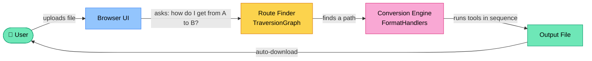
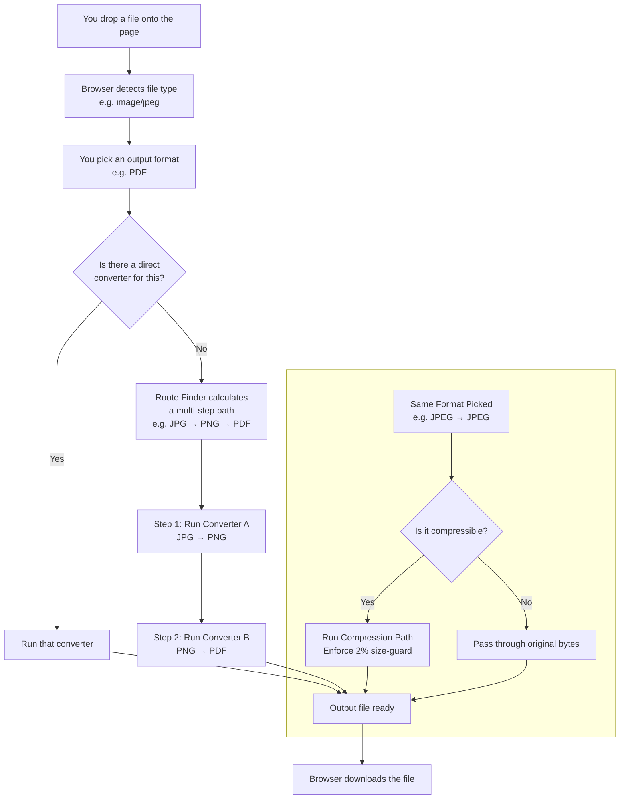
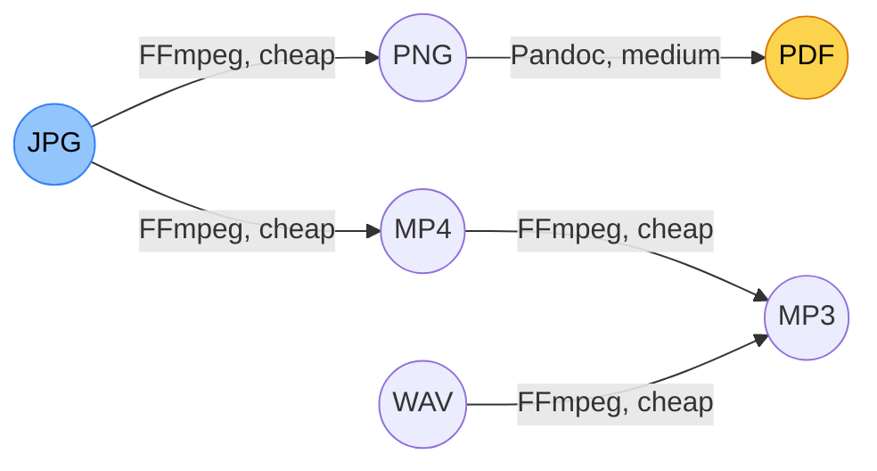
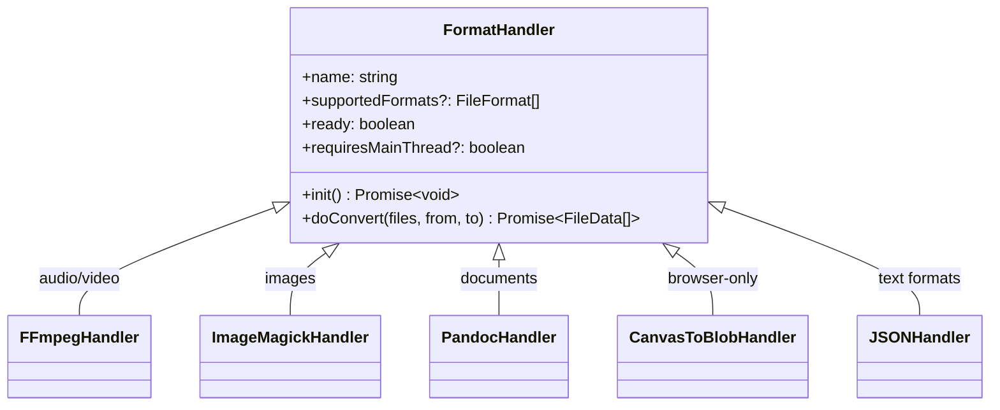
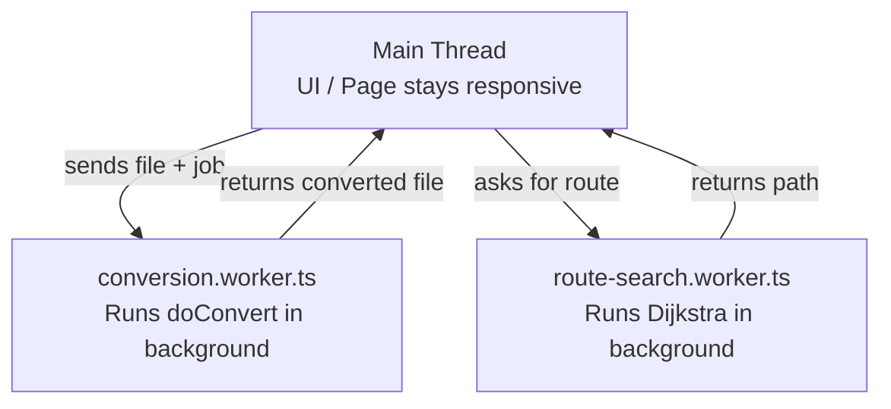
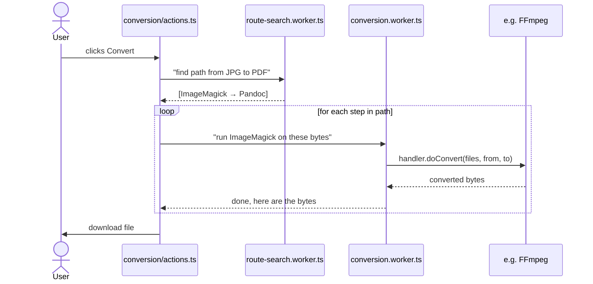
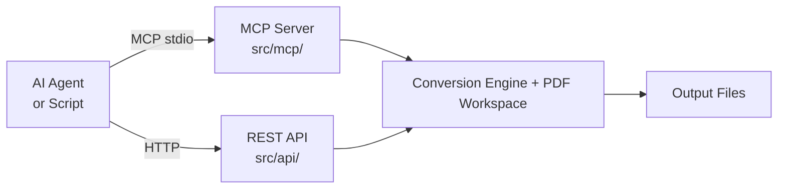

<!-- docs-frontmatter
icon: 🗺️
label: Architecture
desc: How it works under the hood
-->

# frogConvert - How It Works

---

## The Big Picture



Everything stays inside your browser tab. Nothing leaves your computer.

---

## What Happens When You Convert a File

Step-by-step:



---

## The Route Finder (TraversionGraph)

Every file format is a node, every handler is a directed edge. The Route Finder runs **Dijkstra's algorithm** to find the lowest-cost path from the input format to the output format.



Costs go up when:
- The tool is **heavy to start** (like FFmpeg or ImageMagick)
- The conversion is **lossy** (loses quality)
- It **crosses media categories** (e.g., audio → image carries a big penalty to avoid absurd paths)

---

## Conversion Tools (Handlers)

Each converter is called a **handler**. A handler knows:
- Which input formats it accepts
- Which output formats it can produce
- How to actually do the conversion



Some handlers are pure compute (run in a background thread). Others need browser features like `<canvas>` or `AudioContext` and must run on the main thread - that's what `requiresMainThread` controls.

### Handler Examples

| Handler | What it does | Runs where |
|---|---|---|
| `FFmpeg.ts` | Audio/video conversion | Background worker |
| `ImageMagick.ts` | Image conversion | Background worker |
| `pandoc.ts` | Documents (PDF, DOCX, MD…) | Background worker |
| `canvasToBlob.ts` | Encodes images using the browser's canvas | Main thread |
| `json.ts` | JSON ↔ other data formats | Background worker |
| `font.ts` | Font file conversion | Background worker |
| `libreoffice.ts` | Office docs → PDF (DOCX, PPTX, XLSX, ODT…) | Main thread (native binary or remote API) |

---

## PDF Workspace (Editor Mode)

frogConvert ships a second workspace alongside the converter: an in-browser **PDF editor**. Unlike the conversion pipeline, which originates from the [Convert to it!](https://github.com/p2r3/convert) fork, the PDF Workspace is **frogConvert-original**; it is not present in the upstream project. It is a parallel subsystem and **does not route through TraversionGraph or FormatHandlers**. If you are extending the converter, ignore it. If you are extending the editor, ignore the handler authoring guide.

**App-mode toggle.** [src/main.ts](../src/main.ts) and [src/router.ts](../src/router.ts) maintain an "app mode" state (`converter` vs `pdf`) that swaps which workspace section is visible in [index.html](../index.html). The converter workspace is `#convert-card`; the editor is `#pdf-workspace`.

**Four operations**, each isolated in `src/tools/`:

| File | Operation | Library |
|------|-----------|---------|
| [src/tools/pdfMerge.ts](../src/tools/pdfMerge.ts) | Concatenate multiple PDFs into one | `pdf-lib` |
| [src/tools/pdfOrganize.ts](../src/tools/pdfOrganize.ts) | Reorder, rotate (±90°), insert blank pages | `pdf-lib` |
| [src/tools/pdfExtract.ts](../src/tools/pdfExtract.ts) | Extract a page range as a new PDF | `pdf-lib` |
| [src/tools/pdfWatermark.ts](../src/tools/pdfWatermark.ts) | Stamp text watermark across selected pages, single or tiled | `pdf-lib` |
| [src/tools/pdfThumbnails.ts](../src/tools/pdfThumbnails.ts) | Render page previews (lazy, cached) | `pdfjs-dist` |

**Orchestrator.** [src/components/PdfWorkspace/PdfWorkspace.ts](../src/components/PdfWorkspace/PdfWorkspace.ts) owns the editor UI: tab switching (Merge / Organize / Watermark), drag-and-drop reorder via `sortablejs`, rotation accumulation, watermark live-preview, and download wiring.

**Dependency split.** `pdf-lib` is the **write path** (creates new PDFs). `pdfjs-dist` is the **render path** (only used for thumbnails and the watermark preview). Keep them separate; do not import `pdfjs-dist` in tool files.

**Safari note.** `pdfjs-dist` thumbnail rendering hits Safari JS-engine limits with PDF input. [src/tools/pdfThumbnails.ts](../src/tools/pdfThumbnails.ts) carries a fallback path; preserve it when refactoring.

**Where to put new code.** A new conversion (e.g. PDF → CSV) is a new handler under `src/handlers/`. A new PDF editing operation (e.g. sign) is a new tool under `src/tools/` plus a new tab in `PdfWorkspace.ts`. They are not interchangeable.

---

## Web Workers (Why the Page Doesn't Freeze)

Converting a video can take seconds. If that ran on the browser's main thread, the whole page would lock up.

frogConvert uses **Web Workers** - background threads that run heavy work without touching the UI:



Handlers with `requiresMainThread: true` are the exception - they need browser APIs that only exist on the main thread, so they run there.

---

## Code Structure at a Glance

```
frogConvert/
├── src/
│   ├── handlers/           ← Conversion tools (FFmpeg, ImageMagick, etc.)
│   ├── core/
│   │   ├── FormatHandler/  ← The FormatHandler interface + base classes
│   │   ├── TraversionGraph/← Route-finding algorithm (Dijkstra)
│   │   ├── CommonFormats/  ← Registry of all MIME types and extensions
│   │   ├── utils/          ← Shared core helpers
│   │   └── index.ts        ← Barrel re-export
│   ├── tools/              ← PDF editor ops (merge, organize, extract, watermark, thumbnails)
│   ├── workers/
│   │   ├── conversion.worker.ts   ← Runs handlers off the main thread
│   │   └── route-search.worker.ts ← Runs pathfinding off the main thread
│   ├── components/         ← UI only: FormatModal, FilesModal, PdfWorkspace,
│   │                         Toast, TopBar, UploadZone, Frogsworth, store, utils, …
│   ├── conversion/         ← Conversion-flow orchestration (actions, cancellation, downloads)
│   ├── constants/          ← UI constants (breakpoints, limits, defaults)
│   ├── mcp/                ← MCP server for AI agents (Node.js, stdio)
│   └── api/                ← REST API server (HTTP on localhost:3000)
├── docs/
│   ├── ARCHITECTURE.md     ← This file
│   ├── CONVERTER.md        ← End-user converter guide
│   ├── PDF_EDITOR.md       ← End-user PDF editor guide
│   ├── HANDLERS.md         ← Authoring a new format handler
│   ├── INTEGRATIONS.md     ← MCP/REST API reference
│   ├── DEPLOYMENT.md       ← Self-host, Docker, desktop, CLI
│   └── CONTRIBUTING.md     ← PR workflow, testing, style
├── test/
│   ├── e2e/                ← End-to-end browser tests (Puppeteer)
│   ├── resources/          ← Fixture files
│   ├── setup.ts            ← Vitest preload + MockWorker
│   └── MockedHandler.ts    ← Stub FormatHandler for graph tests
├── AGENTS.md               ← Rules for AI pair-programming agents
├── SECURITY.md             ← Privacy posture and disclosure
├── CHANGELOG.md            ← Release history
└── README.md               ← Landing page
```

Unit tests are **colocated** under `src/**/*.test.ts` (next to the code they cover); `test/` holds only e2e, fixtures, and shared mocks.

---

## State Management (Without React)

frogConvert doesn't use React or Vue. It's plain TypeScript + DOM manipulation.

Shared state lives in `store.ts` as simple objects:

```typescript
// Example from store.ts
export const currentFiles: { value: File[] } = { value: [] };
```

Components read and write `.value` directly. It's simple on purpose - fast to load, easy to trace.

---

## The Conversion Flow in Code

When you hit Convert:



---

## The MCP Server & REST API

frogConvert exposes both the conversion engine and the PDF editor as a **local server** so scripts, automation tools, and AI assistants can drive them without opening a browser.



Both run 100% locally. The MCP server exposes 7 tools (`list_formats`, `find_conversion_path`, `convert_file`, `pdf_merge`, `pdf_organize`, `pdf_extract`, `pdf_watermark`). The REST API mirrors the same surface. See [INTEGRATIONS.md](INTEGRATIONS.md) for request/response shapes.

---

## Surface vs engine seam

Engine modules ([src/tools/pdfWatermark.ts](../src/tools/pdfWatermark.ts), [src/handlers/](../src/handlers/)) implement the full capability set. The three public surfaces, UI ([src/components/](../src/components/)), MCP ([src/mcp/tools/](../src/mcp/tools/)), and REST ([src/api/routes/](../src/api/routes/)), are curated views over that engine. The three surfaces stay aligned with each other for behavior-shaping fields; the engine may exceed them.

Re-introducing a previously-removed surface feature is a wire change at the surface layer, not an engine rewrite. Example: `pdfWatermark.ts` retains image source and 5-placement support (`top-left`, `top-right`, `bottom-left`, `bottom-right`, `center`) even though the UI, MCP, and REST surfaces all expose only text + center. If image watermarks return to the UI, the engine work is already done, only the surface layers need wiring.

Transport-affordance fields (`filePath`, `base64Bytes`, `outputFilePath`, `outputDir`) are an explicit carve-out: they are MCP/REST-only by necessity, since the browser UI has no filesystem to address. They do not violate alignment because they have no UI counterpart that could exist.

See [AGENTS.md § rule 12](../AGENTS.md) for the enforcement rule.

---

## Key Terms Glossary

| Term | What it means |
|---|---|
| **Handler** | A wrapper around one conversion tool (FFmpeg, Pandoc, etc.) |
| **FormatHandler** | The TypeScript interface every handler must follow |
| **TraversionGraph** | The route-finding system that chains handlers together |
| **Web Worker** | A background thread in the browser - keeps the UI responsive |
| **requiresMainThread** | A flag that tells the engine "this handler needs browser APIs, don't offload it" |
| **FileFormat** | An object describing a format: its name, MIME type, extension, category |
| **FileData** | A wrapper for a file's bytes (`Uint8Array`) and its name |
| **MCP** | Model Context Protocol - a standard way for AI agents to call tools |
| **Dijkstra** | A graph algorithm that finds the cheapest path (here: fewest/cheapest conversion steps) |
| **WASM** | WebAssembly - compiled native code (like FFmpeg) that runs inside a browser |

---

## How to Add a New Format

Quick version:

1. Create `src/handlers/myFormat.ts`.
2. Implement `FormatHandler` (or extend a base class); declare input/output formats.
3. Register in `src/handlers/index.ts`.
4. The route finder picks it up automatically; no other wiring needed.

Full guide with interface, base classes, builder API, quality presets, warnings, and registration patterns is in **[HANDLERS.md](HANDLERS.md)**.

## See also

- [HANDLERS.md](HANDLERS.md) - authoring a new format handler.
- [CONTRIBUTING.md](CONTRIBUTING.md) - PR process, testing, style.
- [INTEGRATIONS.md](INTEGRATIONS.md) - MCP and REST API.
- [PDF_EDITOR.md](PDF_EDITOR.md) - PDF editor end-user docs.
