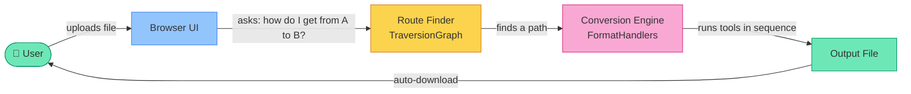
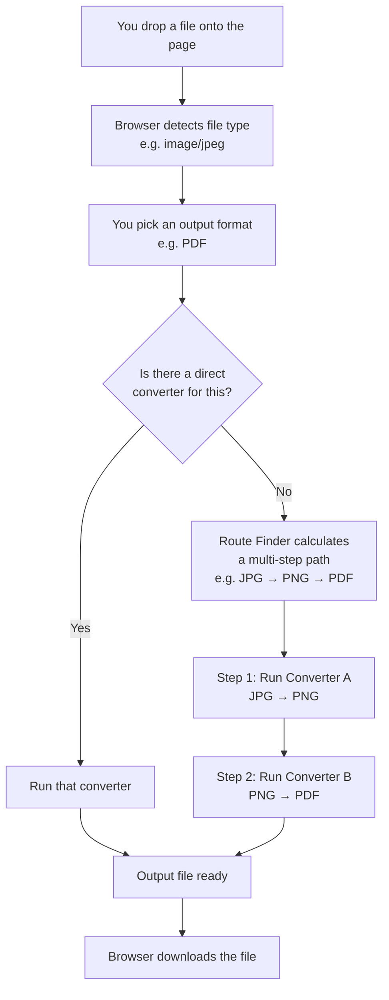
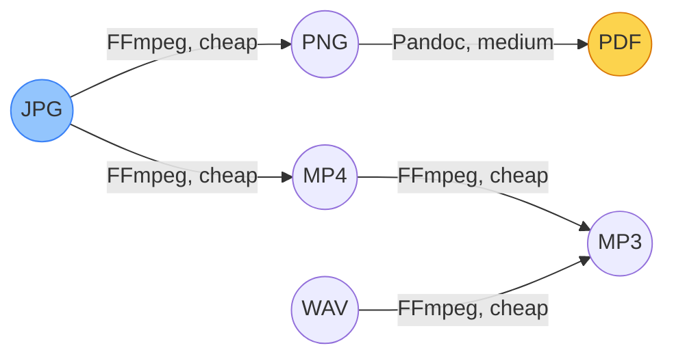
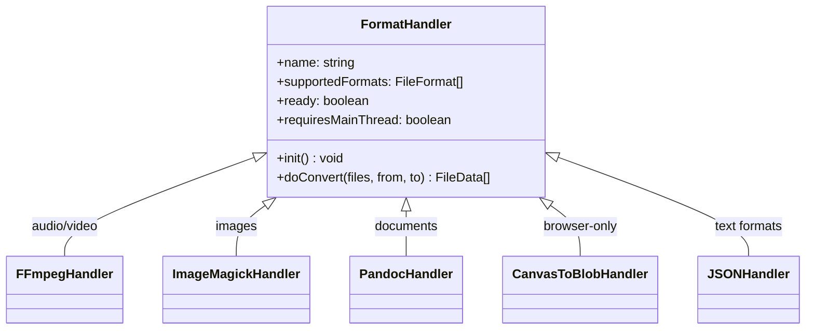
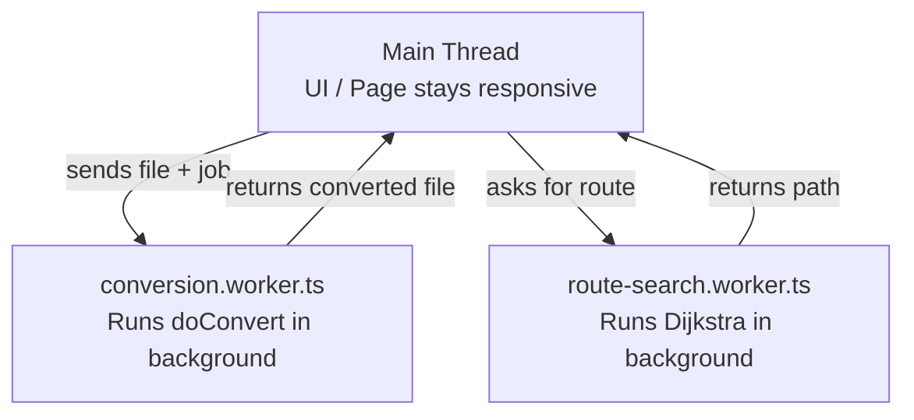
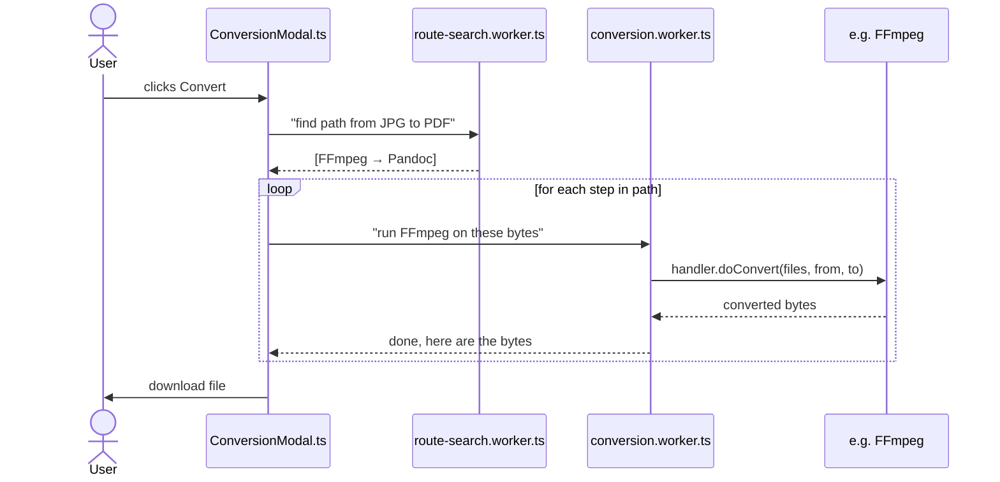
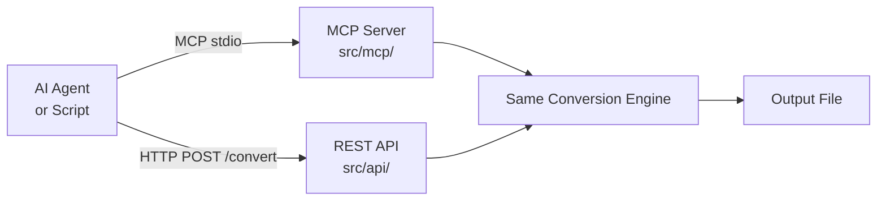

# frogConvert — How It Works (Plain English)

This guide explains frogConvert for beginners and people who are new to the codebase. No prior experience required.

---

## What is frogConvert?

frogConvert is a **file converter that runs entirely in your browser**. You upload a file (like a `.jpg` image), pick an output format (like `.pdf`), and it converts it — without ever sending your file to any server.

Most online converters only handle obvious pairs: image-to-image, video-to-video. frogConvert can convert almost anything to almost anything — even a video to a PDF — by **chaining multiple conversion tools together automatically**.

It runs at [frogconvert.xyz](https://frogconvert.xyz) and is a fork of [Convert to it!](https://github.com/p2r3/convert).

---

## The Big Picture



Everything stays inside your browser tab. Nothing leaves your computer.

---

## What Happens When You Convert a File

Here's the step-by-step flow, in plain terms:



---

## The Route Finder (TraversionGraph)

Think of all file formats as **cities on a map**, and each conversion tool as a **road** between cities.

The Route Finder uses **Dijkstra's algorithm** — the same logic a GPS uses — to find the cheapest path from your input format to your output format.



Costs go up when:
- The tool is **heavy to start** (like FFmpeg or ImageMagick)
- The conversion is **lossy** (loses quality)
- It **crosses media categories** (e.g., audio → image carries a big penalty to avoid absurd paths)

---

## Conversion Tools (Handlers)

Each converter is called a **handler**. A handler knows:
- Which input formats it accepts
- Which output formats it can produce
- How to actually do the conversion



Some handlers are pure compute (run in a background thread). Others need browser features like `<canvas>` or `AudioContext` and must run on the main thread — that's what `requiresMainThread` controls.

### Handler Examples

| Handler | What it does | Runs where |
|---|---|---|
| `FFmpeg.ts` | Audio/video conversion | Background worker |
| `ImageMagick.ts` | Image conversion | Background worker |
| `pandoc.ts` | Documents (PDF, DOCX, MD…) | Background worker |
| `canvasToBlob.ts` | Encodes images using the browser's canvas | Main thread |
| `json.ts` | JSON ↔ other data formats | Background worker |
| `font.ts` | Font file conversion | Background worker |

---

## Web Workers (Why the Page Doesn't Freeze)

Converting a video can take seconds. If that ran on the browser's main thread, the whole page would lock up.

frogConvert uses **Web Workers** — background threads that run heavy work without touching the UI:



Handlers with `requiresMainThread: true` are the exception — they need browser APIs that only exist on the main thread, so they run there.

---

## Code Structure at a Glance

```
frogConvert/
├── src/
│   ├── handlers/          ← Conversion tools (FFmpeg, ImageMagick, etc.)
│   ├── core/
│   │   ├── FormatHandler/ ← The FormatHandler interface + base classes
│   │   ├── TraversionGraph/ ← Route-finding algorithm (Dijkstra)
│   │   └── CommonFormats/ ← Registry of all MIME types and extensions
│   ├── workers/
│   │   ├── conversion.worker.ts  ← Runs handlers off the main thread
│   │   └── route-search.worker.ts ← Runs pathfinding off the main thread
│   ├── components/
│   │   ├── ConversionModal/ ← Progress popup + conversion orchestration
│   │   ├── FormatModal/    ← Format picker UI
│   │   ├── store/store.ts  ← Shared app state (current files, UI refs)
│   │   └── Frogsworth/     ← The mascot frog in the corner
│   ├── mcp/               ← MCP server for AI agents (Node.js, stdio)
│   └── api/               ← REST API server (HTTP on localhost:3000)
├── docs/
│   ├── AGENTS.md          ← Guide for AI agents using the MCP/REST API
│   ├── AGENT_CONTEXT.md   ← Deep architecture guide (also for AI agents)
│   └── OVERVIEW.md        ← This file — plain English intro
├── test/
│   ├── e2e/               ← End-to-end browser tests (Puppeteer)
│   └── *.test.ts          ← Unit tests (Vitest + jsdom)
└── README.md              ← Main docs, deployment, contributing guide
```

---

## State Management (Without React)

frogConvert doesn't use React or Vue. It's plain TypeScript + DOM manipulation.

Shared state lives in `store.ts` as simple objects:

```typescript
// Example from store.ts
export const currentFiles: { value: File[] } = { value: [] };
```

Components read and write `.value` directly. It's simple on purpose — fast to load, easy to trace.

---

## The Conversion Flow in Code

When you hit Convert, here's what actually happens:



---

## The MCP Server & REST API

frogConvert also exposes its conversion engine as a **local server** — so scripts, automation tools, and AI assistants can trigger conversions without opening a browser.



Both run 100% locally. No internet needed. See [AGENTS.md](AGENTS.md) for usage.

---

## Key Terms Glossary

| Term | What it means |
|---|---|
| **Handler** | A wrapper around one conversion tool (FFmpeg, Pandoc, etc.) |
| **FormatHandler** | The TypeScript interface every handler must follow |
| **TraversionGraph** | The route-finding system that chains handlers together |
| **Web Worker** | A background thread in the browser — keeps the UI responsive |
| **requiresMainThread** | A flag that tells the engine "this handler needs browser APIs, don't offload it" |
| **FileFormat** | An object describing a format: its name, MIME type, extension, category |
| **FileData** | A wrapper for a file's bytes (`Uint8Array`) and its name |
| **MCP** | Model Context Protocol — a standard way for AI agents to call tools |
| **Dijkstra** | A graph algorithm that finds the cheapest path (here: fewest/cheapest conversion steps) |
| **WASM** | WebAssembly — compiled native code (like FFmpeg) that runs inside a browser |

---

## How to Add a New Format (Summary for Beginners)

1. Create a new file in `src/handlers/myFormat.ts`
2. Implement the `FormatHandler` interface — define which formats you accept/output
3. Register your handler in `src/handlers/index.ts`
4. The route finder automatically includes your handler in the graph — no other wiring needed

See the full guide in the README — "Creating a Handler" section.
